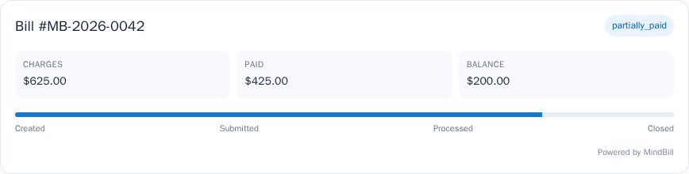
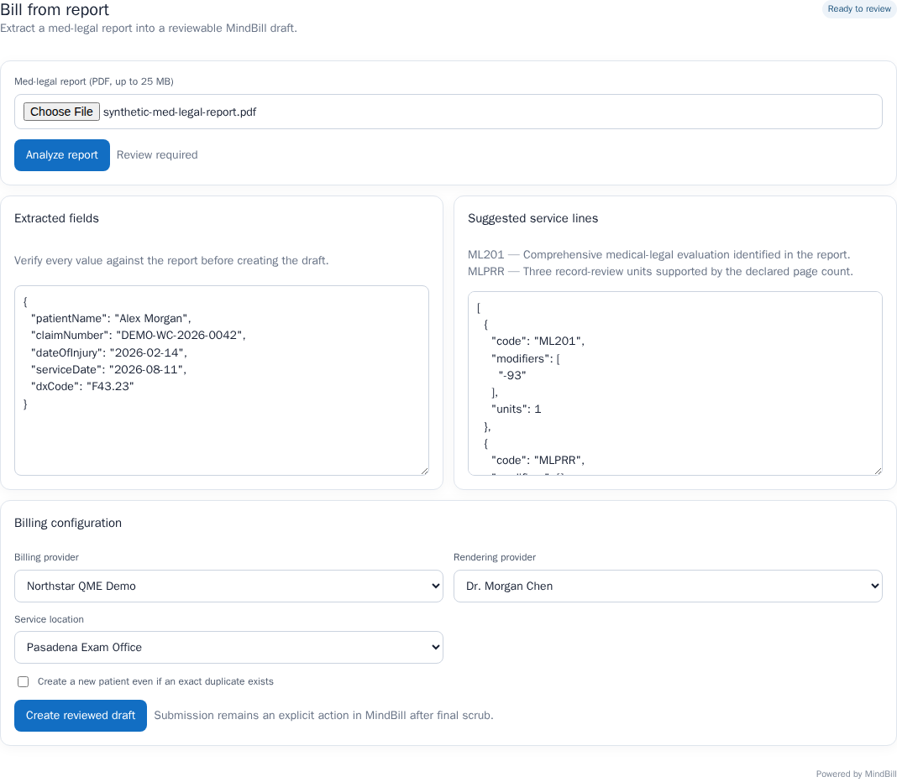
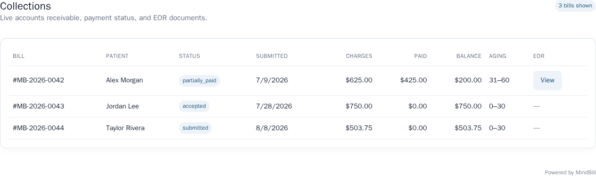
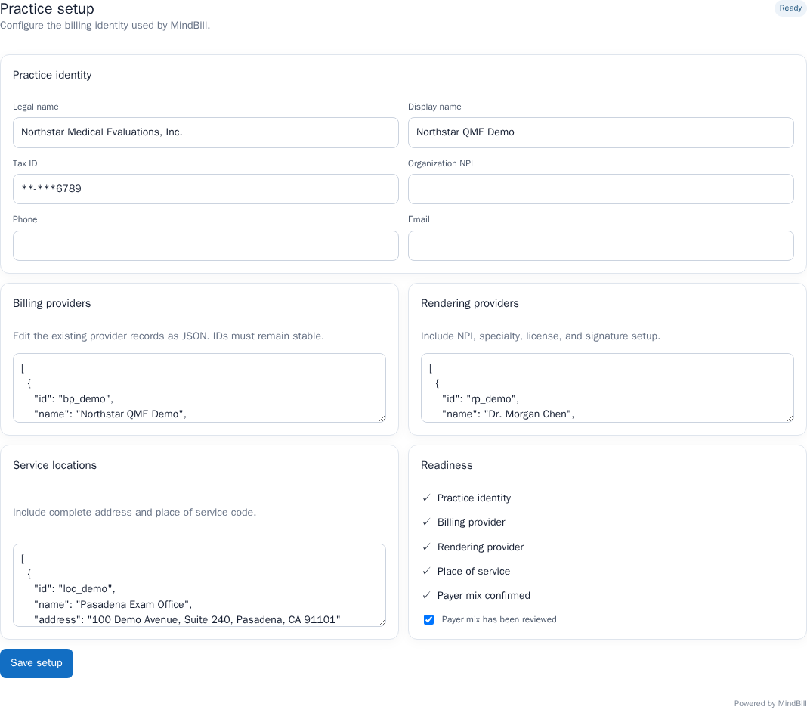
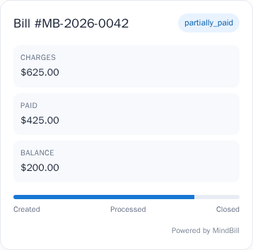
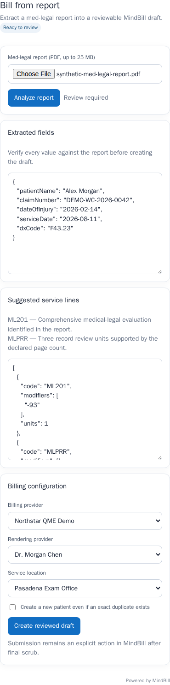

# MindBill SDKs and widgets

Public, dependency-light building blocks for adding California workers’ compensation medical-legal billing to another product. Use the Node SDK for server-to-server API calls and short-lived embed sessions; use the web component or React package for user-facing workflows.

## Embedded billing, not a second system

MindBill is designed to be distributed through the software customers already use. A
partner can provision a managed billing organization, synchronize the minimum practice
and provider data needed for billing, create or submit a bill, and surface its lifecycle
inside the partner product. The customer does not need to accept an invitation, sign into
a separate application, or maintain the same profile in two places.

The ownership boundary is explicit:

- Your product remains authoritative for its customer relationship, workflow, source
  documents, and partner-owned profile fields.
- MindBill remains authoritative for bill validation, submission, acknowledgements,
  denials, payments, and accounts receivable.
- Stable external IDs, idempotent writes, signed webhooks, and cursor reconciliation keep
  the two systems synchronized.
- The Partner API exposes only documented billing resources. Internal routing logic,
  payer intelligence, operational queues, vendor credentials, and cross-customer data do
  not cross the boundary.

For a record-summary product, the natural handoff is: summary completes, the partner
confirms page count and the minimum claim context, the user reviews the suggested billing
configuration, and MindBill submits and tracks the bill. The timeline and collections
widgets return that status to the same product where the user completed the summary.

> Sandbox data must be synthetic. Never send PHI until your organization is approved for live access and the required agreements are complete.

This repository is the canonical public source for all three packages and their
provenance-backed release workflow. Check npm for current package availability;
until a first-party release is present, do not install similarly named mirrors.

## Packages

| Package | Use |
| --- | --- |
| `@mindbill/node` | Typed Node client plus the `mindbill` agent-friendly CLI |
| `@mindbill/embed` | Framework-neutral custom elements |
| `@mindbill/react` | React wrappers around the custom elements |

## See the widgets

These are the real hosted MindBill surfaces rendered with synthetic demo data.
Partners keep their own navigation and workflow while MindBill handles the
billing-specific interface inside an origin-bound iframe.

| Bill timeline | Bill from report |
| --- | --- |
|  |  |
| **Collections** | **Onboarding** |
|  |  |

The layouts are responsive. For example, the same timeline and report-review
flows collapse cleanly for a narrow host surface:

<p align="center">
  
  &nbsp;&nbsp;
  
</p>

## Fastest safe start

Once the first-party packages are available on npm, an agent can create a free
sandbox without handling billing details:

```bash
pnpm dlx @mindbill/node signup \
  --company "Acme Integration Lab" \
  --contact "Avery Agent" \
  --email "developers@example.com" \
  --accept-terms
```

The one-time sandbox key is written to `.env.mindbill` with owner-only permissions and is not printed. Add that file to your project’s `.gitignore`. The command returns only identifiers, the key prefix, and the saved path.

Use the SDK on your server:

```ts
import { MindBillClient } from "@mindbill/node";

const mindbill = new MindBillClient({
  apiKey: process.env.MINDBILL_API_KEY!,
  ...(process.env.MINDBILL_ORG_ID
    ? { organizationId: process.env.MINDBILL_ORG_ID }
    : {}),
});

// Default: provision a customer tenant without a MindBill user, invitation,
// or separate customer onboarding flow.
const customer = await mindbill.provisionOrganization(
  { name: "Synthetic QME Practice" },
  crypto.randomUUID(),
);

await mindbill.synchronizeOrganizationProfile(
  customer.organizationId,
  {
    source: "acme-records",
    practiceIdentity: { name: "Synthetic QME Practice" },
    renderingProviders: [
      { externalId: "provider_42", name: "Avery Example, MD", npi: "1234567893" },
    ],
    locations: [
      {
        externalId: "location_main",
        name: "Main office",
        street: "100 Example Avenue",
        city: "Los Angeles",
        state: "CA",
        zip: "90012",
      },
    ],
  },
  crypto.randomUUID(),
);

const session = await mindbill.createEmbedSession({
  component: "bill-timeline",
  billId: "synthetic_bill_123",
  allowedOrigin: "https://your-product.example",
  expiresIn: 900,
});
```

Return only `token` and `embedUrl` from your own authenticated backend. Render:

```html
<script type="module" src="https://unpkg.com/@mindbill/embed@0.2.0/dist/index.js"></script>
<mindbill-bill-timeline
  session-token="SHORT_LIVED_SESSION_TOKEN"
  embed-url="https://app.mindbill.org/embed/bill-timeline"
  theme="system"
  accent-color="#2563eb"
></mindbill-bill-timeline>
```

For React:

```tsx
import { MindBillBillTimeline } from "@mindbill/react";

<MindBillBillTimeline
  sessionToken={session.token}
  embedUrl={session.embedUrl}
  appearance={{ theme: "system", accentColor: "#2563eb" }}
  onMindBill={(event) => console.log(event.detail.event)}
/>;
```

The widget sends only documented, PHI-free lifecycle events to its host. Keep the API key and embed-session creation on your server.

## Partner-managed customer accounts

`provisionOrganization` defaults to `accessMode: "managed"`. Your product can configure the tenant, create and submit bills, and render MindBill widgets without asking the customer to accept a MindBill invitation or sign into a second application. If a customer later wants direct access to MindBill, call `grantOrganizationUserAccess` as an explicit, auditable action.

Keep workflow and customer-facing data in your product. Treat MindBill as authoritative for bill IDs, submissions, acknowledgements, payments, denials, and ordered event sequences. Synchronize partner-owned practice fields with `synchronizeOrganizationProfile`; sync billing state back with signed webhooks plus cursor reconciliation. Undocumented MindBill data is not exposed by the Partner API.

## From sandbox to live

Live access requires organization onboarding, BAA acceptance, and payment setup. The CLI can request a short-lived Stripe-hosted Checkout URL:

```bash
pnpm dlx @mindbill/node live-access --organization-id org_example
```

Give that URL to an authorized human. Neither this CLI nor your coding agent accepts card numbers, Link credentials, or payment-method data. See [go-live](./docs/go-live.md).

## Documentation

- [Agent-first onboarding](./docs/agent-onboarding.md)
- [Widget integration and customization](./docs/widgets.md)
- [API keys and security](./docs/security.md)
- [Go-live and hosted payments](./docs/go-live.md)
- [Billing lifecycle/domain guide](./docs/domain-guide.md)
- [Examples](./examples)
- [Hosted API reference](https://app.mindbill.org/developers/reference)
- [OpenAPI document](https://app.mindbill.org/partner-openapi.yaml)

Self-serve pricing is $10 per bill. Volume and partner programs are contact-sales. Report autofill is rails-exclusive and available only through a negotiated agreement.

## Support

Open a GitHub issue for public SDK bugs without PHI or credentials. For security reports, production onboarding, autofill, or volume terms, contact MindBill through the developer portal.

## License

MIT. “MindBill” and related marks are trademarks of IncidentFox, Inc.; the license does not grant trademark rights.
